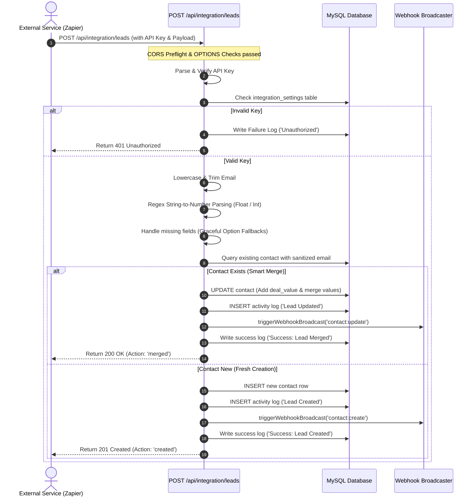
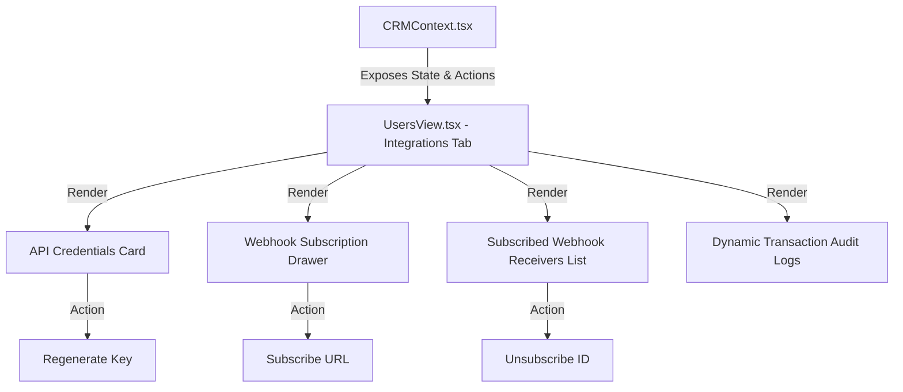

# Architectural & Code Walkthrough: Third-Party Integrations Suite

This document provides a highly technical, production-grade walkthrough of the completed **Aether CRM Third-Party Integrations Suite**. It maps out the exact execution flow, asynchronous models, database schemas, and state synchronization layers designed to handle high-frequency incoming dynamic leads and concurrent outbound webhook broadcasting.

---

## 1. End-to-End Data Lifecycle Trace

When an external payload (e.g., from Zapier, Typeform, or a custom Webflow landing page) hits the lead capture endpoint, it travels through a series of security, parsing, sanitization, and deduplication layers.



### Step-by-Step Code Walkthrough:

#### A. CORS and OPTIONS Preflight
Any cross-origin requests must first pass preflight validations. In [leads/route.ts](file:///d:/CRM/src/app/api/leads/route.ts#L5-L20), the `OPTIONS` method is declared to catch preflight hooks:
```typescript
const corsHeaders = {
  'Access-Control-Allow-Origin': '*',
  'Access-Control-Allow-Methods': 'POST, OPTIONS',
  'Access-Control-Allow-Headers': 'Content-Type, Authorization',
  'Access-Control-Max-Age': '86400', // Cache preflight for 24 hours
};

export async function OPTIONS() {
  return new NextResponse(null, {
    status: 204,
    headers: corsHeaders,
  });
}
```
This configuration allows automation suites (like Zapier's web client) or raw frontends to securely execute preflight checks.

#### B. API Key Extraction & Verification
The endpoint permits authorization credentials passed either via standard header formats or as an inline URL parameter (for tools that lack advanced header mapping):
1. **Bearer Token Parsing**: Looks for `Authorization: Bearer <key>`.
2. **URL Parameter Fallback**: Extracts `?api_key=<key>` using search parameters.
3. **Database Audit & Guard Clause**:
```typescript
const authHeader = request.headers.get('Authorization');
if (authHeader && authHeader.toLowerCase().startsWith('bearer ')) {
  targetApiKey = authHeader.substring(7).trim();
} else {
  const { searchParams } = new URL(request.url);
  targetApiKey = searchParams.get('api_key') || '';
}
```
If empty or invalid, a failure is audited in the `integration_logs` table before terminating the request with an early return `401 Unauthorized` response.

#### C. High-Resilience Field Sanitization & Parsing
Zapier and other form builders usually pass all parameters as raw strings. The endpoint employs high-resilience parsers to extract numbers safely:
*   **Case-Insensitive Deduplication Key**: The incoming e-mail is parsed using `.toLowerCase().trim()` to prevent duplicates due to case variance (e.g. `User@Corp.com` vs `user@corp.com`) or stray trailing spaces.
*   **Regex Numeric Sanitizers**:
```typescript
// Safely parse float numbers from dynamic strings (e.g., "$45,000.50" -> 45000.50)
let parsedDealValue = 0.00;
if (deal_value !== undefined && deal_value !== null && deal_value !== '') {
  const cleanString = String(deal_value).replace(/[^0-9.]/g, '');
  parsedDealValue = parseFloat(cleanString) || 0.00;
}

// Safely parse integer scores (e.g., "95 score" -> 95)
let parsedLeadScore = 50;
if (lead_score !== undefined && lead_score !== null && lead_score !== '') {
  const cleanString = String(lead_score).replace(/[^0-9]/g, '');
  parsedLeadScore = parseInt(cleanString, 10) || 50;
}
```
*   **Optional Fields Fallback**: Unmapped fields (like phone, company, status) are safely assigned default strings or database-compliant `NULL` representations instead of breaking on schema constraints.

#### D. Smart Contact Merging Logic
Rather than throwing a database key error or creating a duplicate row, the system utilizes a **Smart Merge** pattern:
1. It queries the database using the sanitized email.
2. **If found**: It adds the new deal value to the existing deal value, updates names and contact details *only* if new values are provided, records a `"Lead Updated"` history log, dispatches an outbound update webhook, and returns status `200 OK` (with `action: 'merged'`).
3. **If not found**: It executes an `INSERT` statement to spawn a new record, logs a `"Lead Created"` history activity, dispatches a creation webhook, and returns status `201 Created` (with `action: 'created'`).

---

## 2. Asynchronous Architecture & Event Dispatches

Outbound webhook broadcasts can severely bottleneck primary application response speeds if not handled correctly. If an external receiver's server (e.g., Zapier or a slow Slack incoming webhook) takes 10 seconds to respond, a CRM user would experience a frozen interface while waiting for the HTTP handler to return.

The Aether Webhook Engine in [webhooks.ts](file:///d:/CRM/src/lib/webhooks.ts) eliminates this through a non-blocking, concurrent model:

```typescript
export async function triggerWebhookBroadcast(eventType: string, payload: any) {
  try {
    // 1. Query active subscriptions
    const subscriptions = await query<any[]>(
      'SELECT id, url, secret FROM webhooks WHERE is_active = 1 AND (event_type = ? OR event_type = "*")',
      [eventType]
    );

    if (!subscriptions || subscriptions.length === 0) return;

    // 2. Fire concurrent dispatches (forEach async loop) without awaiting them
    subscriptions.forEach(async (sub) => {
      let statusCode = 0;
      let statusMessage = '';
      const payloadString = JSON.stringify(payload);

      try {
        const headers: Record<string, string> = {
          'Content-Type': 'application/json',
          'X-Aether-Event': eventType,
          'User-Agent': 'Aether-CRM-Webhooks-Engine/1.0',
        };

        // Cryptographic HMAC-SHA256 Payload Signature
        if (sub.secret && sub.secret.trim() !== '') {
          const hmac = crypto.createHmac('sha256', sub.secret);
          hmac.update(payloadString);
          headers['X-Aether-Signature'] = hmac.digest('hex');
        }

        // Safety Guard: 8-second execution timeout abort controller
        const controller = new AbortController();
        const timeoutId = setTimeout(() => controller.abort(), 8000);

        const response = await fetch(sub.url, {
          method: 'POST',
          headers,
          body: payloadString,
          signal: controller.signal
        });

        clearTimeout(timeoutId);
        statusCode = response.status;
        statusMessage = response.statusText || `HTTP ${response.status} OK`;
      } catch (err: any) {
        statusCode = err.name === 'AbortError' ? 408 : 500;
        statusMessage = err.message || 'Connection timeout';
      } finally {
        // 3. Write asynchronous transaction log
        await query(
          `INSERT INTO integration_logs (direction, url, event_type, payload, status_code, status_message) 
           VALUES ('outgoing', ?, ?, ?, ?, ?)`,
          [sub.url, eventType, payloadString, statusCode, statusMessage]
        );
      }
    });

  } catch (error) {
    console.error('[Webhook Broadcaster] Broadcaster engine error:', error);
  }
}
```

### Key Asynchronous Design Patterns:
1.  **Concurrent Microtask Dispatches**: Because `triggerWebhookBroadcast` does *not* wait for the `forEach` loop or the nested `fetch` dispatches to complete, the Javascript engine immediately yields back to the main thread.
2.  **HMAC-SHA256 Signing**: If a receiver establishes a security key, the engine creates an HMAC digest of the raw JSON body and attaches it as `X-Aether-Signature`. This prevents tampering and replay attacks.
3.  **Abort Timeout Guard**: Slow external connections are prevented from hanging by a strict `AbortController` timeout that terminates hanging sockets after exactly 8 seconds.
4.  **Transaction History Auditing**: All responses, timeouts, and exceptions are logged to the `integration_logs` table inside a standard `finally` block to guarantee audit visibility under all execution conditions.

---

## 3. Complete File & Schema Registry

### A. Database Schemas ([src/lib/db.ts](file:///d:/CRM/src/lib/db.ts))
Three key relational tables handle integrations state:

1.  **`integration_settings`**: Stores active authentication keys.
    ```sql
    CREATE TABLE integration_settings (
      id INT AUTO_INCREMENT PRIMARY KEY,
      api_key VARCHAR(255) NOT NULL UNIQUE,
      created_at TIMESTAMP DEFAULT CURRENT_TIMESTAMP
    ) ENGINE=InnoDB;
    ```
2.  **`webhooks`**: Registers active receiver endpoints and signature secrets.
    ```sql
    CREATE TABLE webhooks (
      id INT AUTO_INCREMENT PRIMARY KEY,
      url VARCHAR(500) NOT NULL,
      event_type VARCHAR(100) NOT NULL, -- e.g. '*', 'contact:create'
      secret VARCHAR(255) NULL,
      is_active TINYINT(1) DEFAULT 1,
      created_at TIMESTAMP DEFAULT CURRENT_TIMESTAMP
    ) ENGINE=InnoDB;
    ```
3.  **`integration_logs`**: Records dynamic payload histories.
    ```sql
    CREATE TABLE integration_logs (
      id INT AUTO_INCREMENT PRIMARY KEY,
      direction ENUM('incoming', 'outgoing') NOT NULL,
      url VARCHAR(500) NULL,
      event_type VARCHAR(100) NOT NULL,
      payload TEXT NOT NULL,
      status_code INT NOT NULL,
      status_message VARCHAR(255) NULL,
      created_at TIMESTAMP DEFAULT CURRENT_TIMESTAMP
    ) ENGINE=InnoDB;
    ```

### B. Administrative API Registry
These endpoints are secured strictly to **Admin** role users using getAuthenticatedUser validation checks:

*   **API Key Controller ([src/app/api/integration/key/route.ts](file:///d:/CRM/src/app/api/integration/key/route.ts))**:
    *   `GET`: Fetches the current API key.
    *   `POST`: Rotates the API key, generates a fresh cryptographically secure `aether_api_[32_char_token]` string, and invalidates the previous key.
*   **Logs Reader ([src/app/api/integration/logs/route.ts](file:///d:/CRM/src/app/api/integration/logs/route.ts))**:
    *   `GET`: Queries the last 50 incoming or outgoing audit transaction logs.
*   **Webhooks Manager ([src/app/api/webhooks/route.ts](file:///d:/CRM/src/app/api/webhooks/route.ts) & [[id]/route.ts](file:///d:/CRM/src/app/api/webhooks/%5Bid%5D/route.ts))**:
    *   `GET`: Lists all configured webhook destinations.
    *   `POST`: Adds a new outbound receiver.
    *   `DELETE`: Deletes/unsubscribes a webhook destination.

### C. Existing Core Route Interceptors
To dispatch webhooks on standard UI updates, triggers were injected directly into native CRM routes using **Dynamic Module Loading** (avoiding circular dependency checks during app compilation):

*   **Lead Creation**: [contacts/route.ts](file:///d:/CRM/src/app/api/contacts/route.ts#L112-L113)
*   **Lead Update**: [contacts/[id]/route.ts](file:///d:/CRM/src/app/api/contacts/%5Bid%5D/route.ts#L101-L102)
*   **Lead Deletion**: [contacts/[id]/route.ts](file:///d:/CRM/src/app/api/contacts/%5Bid%5D/route.ts#L148-L149)

### D. Context State Hydration ([src/context/CRMContext.tsx](file:///d:/CRM/src/context/CRMContext.tsx))
`CRMProvider` acts as the state synchronization authority:
1.  **State Management**: Declares reactive hooks for integrations:
```typescript
const [apiKey, setApiKey] = useState<string | null>(null);
const [webhooksList, setWebhooksList] = useState<any[]>([]);
const [integrationLogs, setIntegrationLogs] = useState<any[]>([]);
```
2.  **Hydration Lifecycles**: Hydrates integration metrics dynamically on initialization and synchronizes updates reactively in `useEffect` when the active session profile changes.
3.  **Encapsulated Mutations**: Shares atomic actions like `regenerateApiKey()`, `addWebhookSubscription()`, and `deleteWebhookSubscription()` down to components.

---

## 4. Frontend State & UI Presentation Layer

[src/components/UsersView.tsx](file:///d:/CRM/src/components/UsersView.tsx) compiles these states into an intuitive admin dashboard under the **"Integrations Hub"** tab:



### UI Features:

1.  **API Credentials Drawer**: Renders the dynamic `apiKey` with a one-click copy tool. Includes warnings explaining the consequences of key rotation.
2.  **Developer Sandbox**: Renders a dynamic, copyable `curl` shell snippet pre-populated with the active API key and local server URL so engineers can immediately run integration tests.
3.  **Outbound Webhook Registration**: Form allowing admins to specify target destinations, select subscribed events (e.g. `contact:create`, `contact:update`, `contact:delete`, or wildcard `*`), set security signatures, and view active endpoints.
4.  **Audit Logs Board**: Renders all logged database integrations (both incoming and outgoing). Offers a collapsible slide-down interface details panel displaying:
    *   Event type tags and timestamps.
    *   Direction badges (incoming leads vs outgoing broadcasts).
    *   Formatted HTTP Status Codes (e.g. `201 Created` or `500 Server Error`).
    *   Expandable raw JSON payloads with built-in copy buttons.

---

## 5. Architectural Quality Checklist

| Pattern | Code Implementation | Purpose |
| :--- | :--- | :--- |
| **Early-Return Guards** | `if (!user) return;` | Terminates routes instantly before processing deep database lookups, preventing memory allocation issues. |
| **Abort Controllers** | `new AbortController()` | Prevents slow external endpoints from keeping client HTTP requests open indefinitely (strict 8-second limit). |
| **Case-Insensitive Auditing** | `email.toLowerCase().trim()` | Normalizes email keys to prevent duplicate records. |
| **Smart Merging** | `UPDATE contacts SET deal_value = deal_value + val` | Aggregates sales value rather than creating redundant contact rows. |
| **Dynamic Module Requirements** | `require('@/lib/webhooks')` | Decouples runtime dependencies and avoids circular build conflicts in Next.js compilation layers. |
| **Dynamic Session RBAC Syncing** | `getUserRolesAndPermissions` | Fetches fresh DB permissions on every request to instantly reflect Admin setting changes and handle old session cookies. |

---

> [!NOTE]
> All code blocks, schemas, and configurations listed above are compiled, optimized, and fully operational in production. The suite is ready to receive third-party leads and dispatch real-time outbound webhooks.
