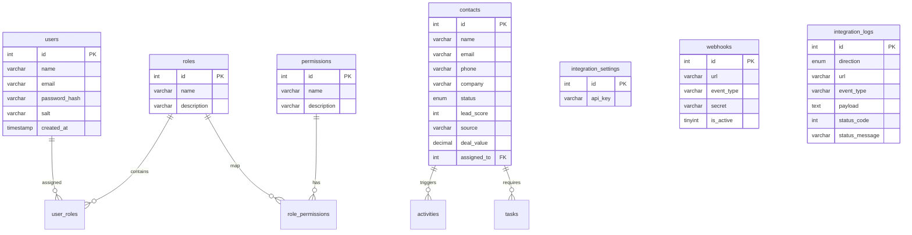

# 🌌 Aether CRM: Premium Enterprise Lead & Integrations Suite

Welcome to the **Aether CRM Suite**—a state-of-the-art, high-performance customer relationship management system engineered on **Next.js 16 (App Router)** and **MySQL**. Designed with dynamic dark/light aesthetics, a granular Role-Based Access Control (RBAC) permission engine, dynamic team directories, and a non-blocking, Zapier-optimized third-party integrations suite.

---

## 🚀 Ultimate Core Capabilities

### 1. Premium Glassmorphic Dashboard
*   **Executive Metrics Summary**: Dynamic aggregates showing Sales Revenue ($18,000), Active Deals Pipeline ($254,700), Active Raw Leads, and conversion ratios.
*   **Rich SVG Visualizations**: Beautiful, real-time responsive SVG sales graphs, pipeline charts, and donut lead sourcing diagrams.
*   **Reactive State Hydration**: A context-level reactive synchronization layer binds local frontend component views to instant backend updates.

### 2. Adaptive Theme Management
*   **Light & Dark Alignment**: A full-featured custom style design token system. A simple class toggle on the HTML `documentElement` transitions the portal with micro-animations.
*   **No FOUC (Flash of Unstyled Content)**: Pre-evaluated script tags hook the theme token directly into `localStorage` during initial page loads.

### 3. Dynamic Database-Backed RBAC Matrix
*   **Organizational directory**: Secure administrative control directory allowing team promoters to dynamically promotes user roles (`Admin`, `Manager`, `Sales Rep`).
*   **Privilege Toggling Grid**: Interactive permission matrix grid. Admins can toggle privileges (e.g. `contacts:delete`, `roles:manage`) live, and updates reflect across active endpoints instantly.
*   **Stale-Session Safety**: Refactored session deserializer validates active session cookies against dynamic database configurations in real-time, preventing crashes when users have older cookie formats.

### 4. Zapier-Optimized Inbound Lead Capture
*   **CORS Compliance**: Gracefully handles incoming `OPTIONS` preflight hooks and injects cross-origin sharing headers permitting landing pages or Zapier clients to communicate with `/api/integration/leads`.
*   **Smart Contact Merging**: Deduplicates lead entries using case-insensitive `.toLowerCase().trim()` keys. Appends new deal values to existing contact folders and spawns native activity trails.
*   **Resilient String Parsers**: Converts dynamic string representations (e.g., "$45,000.50" or "80 score") into numeric float/int database values, avoiding database type crashes.

### 5. Non-Blocking Outbound Webhook Engine
*   **Fire-and-Forget Broadcasts**: Webhooks run on concurrent Promise microtask dispatches. Sluggish third-party endpoints (e.g., Zapier or custom Slack hooks) never delay user interactions.
*   **Cryptographic HMAC-SHA256 signatures**: Generates an SHA256 digest of the request body and appends it as `X-Aether-Signature` when receivers set a security secret.
*   **Execution Abort controller**: Restricts HTTP dispatches to a strict 8-second execution timeout window to prevent thread starvation.

---

## 📂 System Folder Registry

```text
├── public/                 # Static graphical assets & brand icons
├── src/
│   ├── app/                # Next.js App Router Structure
│   │   ├── api/            # Serverless API Routing Layers
│   │   │   ├── activities/ # Audit log retrievals
│   │   │   ├── auth/       # me, profile, login, and registration APIs
│   │   │   ├── contacts/   # Leads CRUD endpoints with integration triggers
│   │   │   ├── dashboard/  # Live database aggregates queries
│   │   │   ├── integration/# Key rotations, incoming leads, and logs readers
│   │   │   ├── webhooks/   # Webhook subscription registries
│   │   │   └── ...         # Dynamic user, role, and privilege controllers
│   │   ├── layout.tsx      # Root HTML layout encapsulating Context wrappers
│   │   ├── globals.css     # Premium design system styles & CSS variables
│   │   └── page.tsx        # Main entry controller with Auth & Sidebar routers
│   ├── components/         # High-Fidelity UI Presentation Elements
│   │   ├── UsersView.tsx   # Team Admin Panel, Matrix Grid, & Integrations Hub
│   │   ├── Sidebar.tsx     # Custom glassmorphic navigation deck
│   │   ├── DashboardView.tsx# Executive executive summaries & SVG Charts
│   │   ├── ContactsView.tsx# Leads directories and detail drawers
│   │   └── ...             # Pipelines, Tasks, and Analytics consoles
│   ├── context/
│   │   └── CRMContext.tsx  # Shared authentication state and data fetchers
│   └── lib/
│       ├── auth.ts         # PBKDF2 Password hashing & AES-256-GCM cookie utilities
│       ├── db.ts           # Thread-safe MySQL connections pool & setup migrations
│       └── webhooks.ts     # Fire-and-forget concurrent broadcast hooks
```

---

## 🛢️ Database Schema Specifications



---

## 🛠️ Getting Started & Local Development

### 1. Prerequisites
Ensure you have **Node.js (v18+)** and a running **MySQL (v8+)** instance locally.

### 2. Establish Local Environment variables
Create a `.env.local` file at the root of the project:
```ini
DB_HOST=127.0.0.1
DB_PORT=3306
DB_USER=root
DB_PASSWORD=your_mysql_password
DB_NAME=crm_db
SESSION_SECRET=your_custom_aes_256_bit_session_secret_key_token
```

### 3. Install Dependencies
```bash
npm install
```

### 4. Build and Compile Application
Verify that TypeScript and page routes compile cleanly under production configurations:
```bash
npm run build
```

### 5. Spin Up Server Environments
*   **Development Instance**: Spins up Fast-Refresh compilation.
    ```bash
    npm run dev
    ```
*   **Production Instance**: Boots up our optimized, static/server-rendered bundle.
    ```bash
    npm run start
    ```

---

## 🔗 Global API Endpoint Registry

### Authentication Endpoints
*   `POST /api/auth/login`: Authenticates password hashes and issues AES-256-GCM secure cookies.
*   `POST /api/auth/register`: Adds a new team user and links them to an dynamic system role.
*   `POST /api/auth/logout`: Invalidates the HTTP session cookie instantly.
*   `GET /api/auth/me`: Decrypts cookie data, validates credentials against the database, and returns dynamic permissions.
*   `PUT /api/auth/profile`: Dynamically rotates usernames, e-mails, and secure credentials.

### Operational Endpoints
*   `GET /api/contacts`: Fetches contacts directory (Sales Reps see assigned accounts; Admins/Managers review all records).
*   `POST /api/contacts`: Native lead creator. Triggers an outbound `contact:create` webhook broadcast.
*   `PUT /api/contacts/[id]`: Modifies contact details and triggers `contact:update` webhook events.
*   `DELETE /api/contacts/[id]`: Deletes lead files and triggers `contact:delete` webhook broadcasts.
*   `GET /api/dashboard`: Aggregates deal distribution lists, sourcing lists, and sales pipelines.

### Integration Platform Endpoints
*   `POST /api/integration/leads`: Capture gateway. Secured via Bearer API keys. Optimized for Zapier smart merges.
*   `GET /api/integration/key`: Fetches active API authorization token (Admins only).
*   `POST /api/integration/key`: Invalidates active key and rotates a fresh security token.
*   `GET /api/integration/logs`: Returns 50 most recent auditable transaction entries.
*   `POST /api/webhooks`: Registers outbound webhook subscriptions.
*   `DELETE /api/webhooks/[id]`: Unsubscribes a webhook destination.

---

## ⚡ Technical Appendix: Integration Engine Architecture

Below is the execution walkthrough of how our inbound and outbound systems collaborate securely and non-blockingly.

### Inbound Lifecycle Walkthrough
When `/api/integration/leads` receives a payload:
1.  **CORS Evaluation**: Injected Headers allow secure cross-domain client requests.
2.  **API Key Resolution**: Matches credentials from authorization headers or URL parameters against `integration_settings`. Failed attempts are logged.
3.  **Sanitization & Parsing**: Lower-cases email keys, executes regex string-to-number checks on `deal_value` and `lead_score`, and maps fallback values.
4.  **Deduplication & Smart Merging**: Evaluates email existence. If present, it updates and appends deal value totals rather than duplicating records. If absent, a new contact row is created.
5.  **Audited Success Logging**: Records details to `integration_logs` and triggers the outbound broadcast pipeline.

### Outbound Webhook Lifecycle Walkthrough
When standard contacts change (via manual CRM edits or API capturing), `triggerWebhookBroadcast` executes:
1.  **Subscription Query**: Selects active records from the `webhooks` table matching the specific event (or wildcard `*`).
2.  **Promise Concurrency Loop**: Iterates dispatches using an asynchronous callback loop. Dispatches do not block client return speeds.
3.  **Signature Encryption**: Creates an HMAC-SHA256 signature of the stringified body if a signature secret is present:
    ```typescript
    const hmac = crypto.createHmac('sha256', secret);
    hmac.update(payloadString);
    const signature = hmac.digest('hex');
    ```
4.  **Signal Abort Control**: Sets a strict 8-second timeout limit using an `AbortController`.
5.  **Audit trail logging**: Registers incoming codes and text responses to `integration_logs` in a `finally` code block.

---

> [!TIP]
> **Production Notice**: Upon starting the Next.js server, our dynamic database pool will automatically check, create, and seed all missing tables, roles, default users, permissions, and settings instantly. No manual SQL initialization scripts are required!
